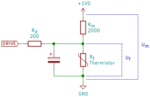

---
title: How Pumpunjuksautin works
...

Pulls voltage over NTC thermistor while recovering original thermistor
resistance.

The firmware has bookkeeping about the duty cycle. For example if the
DRIVE is on LOW state for 10 ms and in HI-Z state for 90 ms, the duty
cycle D is 0.9.

$R_t = \left(\frac{\frac{U_m}{U_f}-1}{R_m}-\frac{D}{R_d}\right)^{-1}$



This allows us to control at the same time as doing measurements.

## Rendering this document
```sh
pandoc -s --mathjax -i control.md -o control.html
```
